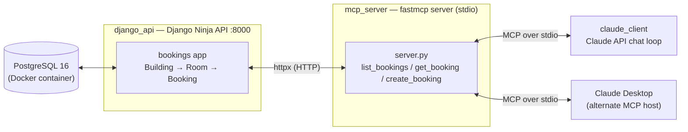

# Py-AI-MCP-Demo

Booking assistant, built as an integration demo of MCP protocol with Python, covering:
- backend with Django using PostgreSQL and Django Ninja REST API
- `fastmcp` as MCP server over stdio, wrapping REST API endpoints as tools
- tools calling from a real LLM client (Anthropic Claude API) in a natural language chat loop, and optionally avalabile from Claude Desktop as an alternate MCP host

It's organized as a single `uv` workspace (the closest analog to a `.sln`) with three independently runnable members under `src/`.

## Architecture



Django ORM handles DB, `mcp_server` only talks to Django over HTTP (never imports its code), and both MCP clients talks to `mcp_server` over a stdio pipe.

## Features

- **Bookings domain API** (Django Ninja): list bookings with prametrized query filters (`room_id`, `building_id`, `date`, `booked_by`), get a booking by id, create a booking; expose auto-generated OpenAPI docs at `/api/docs` .
- **Django Admin** over entities `Building` / `Room` / `Booking` for quick visual sanity-checking, backed by seed data (two buildings, four rooms, four bookings) applied via data migrations.
- **MCP server** `fastmcp`, stdio transport; exposing `list_bookings`, `get_booking`, and `create_booking` as LLM-callable tools, each wrapping a Django Ninja endpoint over `httpx`.
- **Layered error handling**: a missing booking/room and a downed/timed-out API both surface with `ToolError` messages instead of stack traces, at every layer (Django → MCP tool → chat loop).
- **Natural-language chat loop** (`claude_client`): a scriptable Anthropic Messages API client that discovers the MCP server's tools, bridges MCP's tool schema into Anthropic's `input_schema` format, and runs a full multi-turn tool calls loop (including parallel tool calls in one turn).
- **Two interchangeable MCP hosts**: the same `mcp_server` works identically from the scripted `claude_client` loop and from Claude Desktop.
- **Structured JSON logging** across all three processes (Django, MCP server, client), correlated by a shared `request_id` across the MCP → Django HTTP hop.

## Tech stack

| Layer | Technology |
|---|---|
| Language / tooling | Python 3.12, [`uv`](https://docs.astral.sh/uv/) workspace (single lockfile, independently runnable members) |
| Database | PostgreSQL 16, via Docker Compose |
| API framework | Django 6.1 + Django Ninja (Pydantic-backed schemas, auto OpenAPI docs) |
| DB driver | `psycopg[binary]` |
| MCP server | `fastmcp` (standalone package, not the `mcp` SDK's bundled class) |
| HTTP client (MCP → API) | `httpx` (async) |
| LLM client | `anthropic` (Messages API, async), `python-dotenv` for config |
| Linting | Ruff, shared at the workspace root across all members |

## Requirements

- [Docker Desktop](https://www.docker.com/products/docker-desktop/) (for PostgreSQL)
- [`uv`](https://docs.astral.sh/uv/getting-started/installation/)
- An [Anthropic API key](https://console.anthropic.com/) (for the `claude_client` chat loop) — not needed if you only run the Django API and MCP Inspector
- Windows/PowerShell 7 is the environment this was built and documented against; the same `uv`/Docker commands work on macOS/Linux with the shell syntax adjusted

## How to run it locally

Secrets are never committed: copy [`.env.example`](.env.example) at the workspace root to file `.env` and fill key with the real value:

```powershell
Copy-Item .env.example .env
notepad .env   # set ANTHROPIC_API_KEY=sk-ant-...
```

Then, from the workspace root:

```powershell
# 1. Start PostgreSQL
docker compose up -d
docker compose ps   # confirm bookings-postgres is running

# 2. Apply migrations (schema + seed data) — first run only
cd src\django_api
uv run python manage.py migrate

# 3. (optional) create an admin user to browse http://127.0.0.1:8000/admin/
uv run python manage.py createsuperuser

# 4. Start the Django Ninja API — leave this running in its own terminal
uv run python manage.py runserver
```

In a **second terminal**, verify the MCP server directly with the Inspector (optional, no host required):

```powershell
cd src\mcp_server
uv run fastmcp dev inspector server.py
```

In a **third terminal**, run the natural-language chat loop against the same MCP server:

```powershell
cd src\claude_client
uv run python client.py
```

Try a prompt like `"What's booked in Meeting room A?"` — it should call `list_bookings` and answer from real Postgres-backed data.

Alternatively, connect the MCP server to Claude Desktop instead of the scripted client:

```powershell
cd src\mcp_server
uv run fastmcp install claude-desktop server.py
```

(see [`src/mcp_server/README.md`](src/mcp_server/README.md) for the Microsoft Store install path caveat).

To stop Postgres without losing data (it's a named volume): `docker compose stop postgres` or `docker compose down`.

## Out of scope (documented, not built)

Deliberate scope cuts for this sprint — understood conceptually, not implemented:

- **Full OAuth 2.1 resource-server / authorization flow.** The MCP spec makes authorization optional and inapplicable to stdio transport (a local process is already inside a trusted boundary) — not worth rushing in a short sprint.
- **Remote/HTTP MCP transport.** stdio only; the server is always launched as a local subprocess by its host.
- **Enterprise Managed Authorization (EMA).**
- **Entra ID → legacy-system identity mapping.** Conceptually understood from prior work, but there's no legacy system in this project for it to apply to.
- **Django REST Framework.** Django Ninja was chosen instead as the faster, more ASP.NET-Web-API-like path to learn in a short sprint; DRF is a separate, later exploration.

## Possible next steps

- Add MCP **resource** and/or **prompt** primitives, not just tools.
- Add Streamable HTTP transport with a minimal bearer/API-key check, as a proof-of-concept of the auth layer discussed above (not full OAuth).
- Containerize the whole stack and wire a basic CI pipeline (GitHub Actions).
- A separate pass at Django REST Framework, now that Django's shape is familiar via Ninja.
- Run the `claude_client` chat loop against a local Ollama model instead of the hosted Claude API (the original plan's target backend; swapped for environment reasons) — the tool-calling loop itself is designed to be portable, only the model-client call site would change.

## Projects

- [`src/django_api`](src/django_api/README.md) — PostgreSQL-backed Django Ninja REST API over the bookings domain
- [`src/mcp_server`](src/mcp_server/README.md) — `fastmcp` MCP server wrapping the API as tools, over stdio
- [`src/claude_client`](src/claude_client/README.md) — Anthropic Claude API chat loop driving the MCP server
